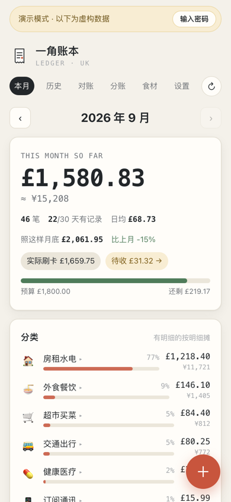
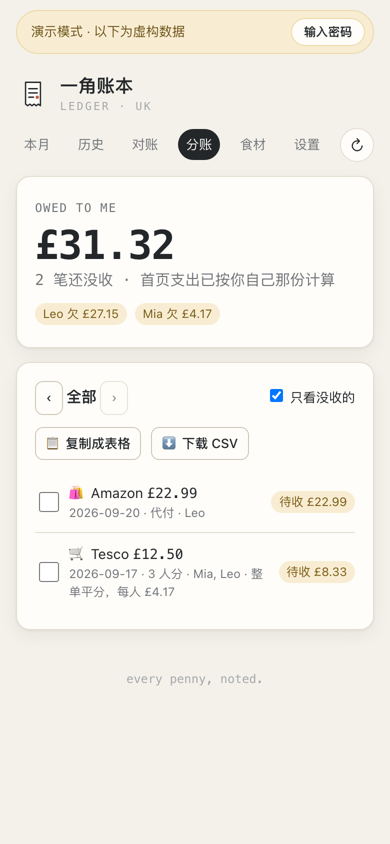
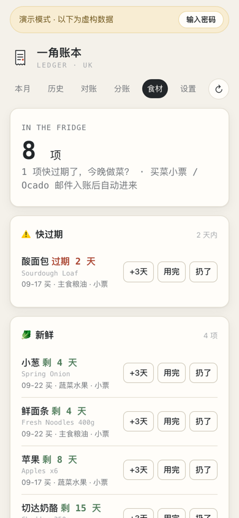
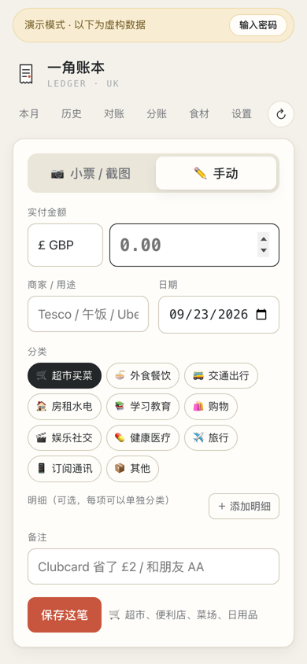
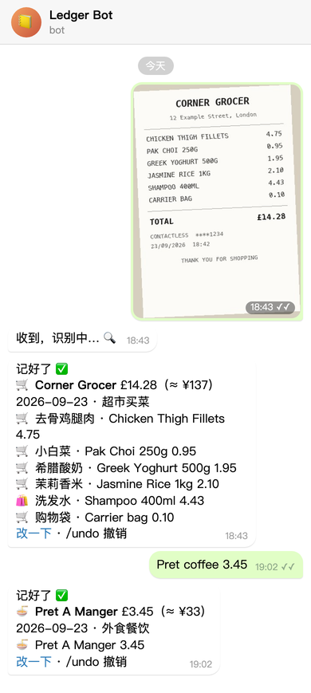
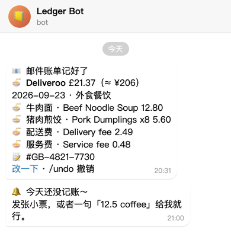
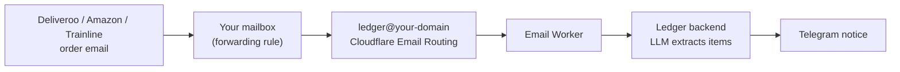

# Ledger · 一角账本

**English** | [中文](README.zh-CN.md)

A self-hosted, mobile-first expense tracker built for a student living in the UK. Snap a receipt, forward an
order email, or send one line to a Telegram bot, and the expense is recognised, categorised and converted
between GBP and CNY. The interface is in Chinese.

<p>
  
  
  
  
</p>

<sub>Screenshots use the built-in demo data (`DEMO_MODE=1`); every record is fictional.</sub>

## What you need

Only a password is required. Each other item switches on more features; leave it out and the rest still works.

| Item | Required? | What it enables | How to get it |
|---|---|---|---|
| `ADMIN_TOKEN` | **Yes** | Site password (also the Telegram bind phrase) | Choose one |
| Zhipu API key (`VISION_API_KEY`) | Recommended | Receipt / screenshot recognition, one-line entries, email bills, bank SMS | [open.bigmodel.cn](https://open.bigmodel.cn); any OpenAI-compatible endpoint works via `VISION_API_BASE_URL` |
| Telegram bot token | Recommended | Record by chat, daily reminders, monthly report, email-bill notifications | @BotFather → `/newbot` |
| A domain on Cloudflare | For email bills | A forwarding address such as `ledger@your-domain` (Email Routing + a Worker), no mailbox password needed | Free Cloudflare plan |
| IMAP mailbox + app password | Optional | Alternative to Cloudflare: poll a mailbox (e.g. Gmail) for bills | Your mail provider |
| Google service account + Sheet | Optional | Two-way sync of a shared flat-expenses sheet | Google Cloud console |
| A server | For hosting | Anything that runs Docker; the included scripts target single-node K3s | — |

Exchange rates come from frankfurter.dev and need no key.

## Features

- **Four ways to record**
  - Receipt photo or screenshot → a vision model (Zhipu GLM, OpenAI-compatible API) extracts merchant, date,
    total, line items and categories; review, then save.
  - Manual entry.
  - Telegram bot: send a receipt photo, or a line such as `12.5 coffee`, `Tesco 23.40`, `¥68 hotpot`.
  - Email bills: forward Deliveroo / Uber Eats / Just Eat / Amazon / Trainline emails to a dedicated address.
    An LLM extracts the items and order number; repeat emails for the same order are merged, marketing mail
    is ignored.
- **Categories**: 11 top-level categories with sub-categories, assignable per line item (shampoo bought at
  Tesco counts as shopping, not groceries).
- **Monthly summary**: totals in £ and ≈¥, daily average, month-end projection, comparison with last month,
  category breakdown, daily bars, optional budget.
- **Exchange rates**: daily GBP→CNY rate from frankfurter.dev (ECB), locked per expense; CNY / EUR / USD
  receipts are converted automatically.
- **Reminders**: Telegram nudge at 21:00 (London time) if nothing was logged that day; monthly report on the 1st.
- **Personal reminders**: tell the bot "remind me tomorrow at lunch to bring a gift" (in Chinese or English); it
  parses the time, pings you before then, and the reminder shows on the History calendar. `/reminders` lists them.
- **Reconciliation**: paste bank SMS or a statement screenshot; each transaction is matched as recorded /
  probably recorded (confirm with `/ok`) / missing (added automatically).
- **Split bills**: swipe to split with flatmates, per-item "mine / shared / theirs", or mark as paid for
  someone else; totals owed per person.
- **Shared flat sheet** (optional): two-way sync with a Google Sheet shared with flatmates; only the shared
  part of each bill is pushed.
- **Pantry**: perishable groceries enter a pantry with an estimated shelf life; reminders before they expire,
  and optional links to a recipe site.
- **De-duplication**: order number, same day / amount / merchant, and SMS placeholders within ±3 days merge
  emails, screenshots, receipts and SMS into one expense.
- **Demo mode**: `DEMO_MODE=1` serves generated sample data, read-only, with no background jobs.

## Try it locally

Requirements: Python 3.11+, Node.js 20+.

```bash
# backend (demo data, no API keys needed)
python3 -m venv .venv && .venv/bin/pip install -r backend/requirements.txt
cd backend && DEMO_MODE=1 ADMIN_TOKEN=guest ../.venv/bin/uvicorn app:app --port 8070

# frontend, in another terminal
cd frontend && npm install && DEMO_BACKEND_ORIGIN=http://127.0.0.1:8070 npm run dev
# open http://localhost:3070/?demo=1
```

For real use, start the backend without `DEMO_MODE` and set `ADMIN_TOKEN` to your password. Without
`VISION_API_KEY` receipts can only be entered manually; without `TELEGRAM_BOT_TOKEN` the bot and reminders
stay off. All options are documented in [`backend/config.py`](backend/config.py).

## Project layout

```
backend/    FastAPI + SQLite (data/ledger.db; receipt images in data/receipts/)
  app.py         routes; everything except /api/login and /api/health needs Bearer ADMIN_TOKEN
  service.py     saving an expense (FX), Telegram messages, monthly report
  vision.py      receipt recognition and one-line classification
  mail.py        email bills: MIME → text → LLM → expense (push and IMAP entry points)
  telegram.py    bot long-polling
  scheduler.py   reminders (one tick per minute)
  pantry.py      pantry sync and shelf-life estimates
  sheets.py      Google Sheet two-way sync
  demo_seed.py   sample data for DEMO_MODE
frontend/   Next.js 16 (port 3070, proxies /api to the backend on 8070)
deploy/     K3s manifests, Dockerfiles, one-command deploy, Cloudflare email worker
```

## Telegram

<p>
  
  
</p>

Send a receipt photo and the bot replies with the recognised items, translated names and the CNY equivalent;
a line such as `Pret coffee 3.45` or `¥68 hotpot` works too. Every reply links back to the web page for edits,
and `/undo` removes the last entry. Other commands: `/today`, `/month`, `/fridge`, `/used`, `/split`, `/help`.

1. Create a bot with @BotFather and put the token in `deploy/secret.yaml` (`TELEGRAM_BOT_TOKEN`).
2. After deploying, send your site password to the bot as a message to bind it.
3. Reminder times, test messages and unbinding are on the settings page.

<sub>The chat images are illustrations: the reply texts are generated by the bot's own code with sample data.</sub>

## Email bills

Takeaway, online shopping and train tickets arrive as emails anyway, so forwarding them is the least effort:
set one rule in Outlook or Gmail once, and every future bill is recorded with its line items, with a Telegram
notice when it lands (right-hand image above). No mailbox password is shared with the server.



- Several emails for one order (confirmation, then delivery) are merged by order number; marketing mail is ignored.
- Only senders in `MAIL_ALLOWED_SENDERS` (comma-separated, `@domain` allowed) are accepted.

**Setup (push, recommended)**

1. Cloudflare → Email → Email Routing: enable it for your domain (MX records are added automatically).
2. Workers & Pages → create a Worker from [`deploy/cloudflare-email-worker.js`](deploy/cloudflare-email-worker.js)
   with variables `LEDGER_URL` (your site) and `LEDGER_SECRET` (= `MAIL_INBOUND_SECRET`).
3. Email Routing → custom address, e.g. `ledger@`, action "Send to a Worker".
4. Set `MAIL_INBOUND_ADDRESS` and `MAIL_ALLOWED_SENDERS` in `deploy/local.env`.
5. In your mailbox, add a rule such as "sender contains deliveroo → forward to ledger@your-domain".

**Alternative (IMAP polling)**: set `MAIL_USER` / `MAIL_PASSWORD` / `MAIL_FOLDER` for mailboxes that support
app passwords (e.g. Gmail); the backend checks for unread mail every 2 minutes.

## Deploy (K3s)

```bash
cp deploy/local.env.example deploy/local.env           # server, domain, sender allow-list
cp deploy/secret.example.yaml deploy/secret.yaml       # password and API keys
bash deploy/sync-and-deploy.sh
```

The script rsyncs the source to the node, builds both images there, imports them into containerd, fills the
placeholders in `deploy/k8s.yaml` from `local.env`, and applies it. The secret is applied only on first deploy
(or with `SEED_SECRET=1`). A demo backend runs alongside the real one; the frontend routes requests with the
`guest` token to it, so visitors can look around without seeing your data.

Run exactly **one** backend replica: Telegram long-polling and reminder de-duplication are in-process.

## License

[AGPL-3.0](LICENSE)
