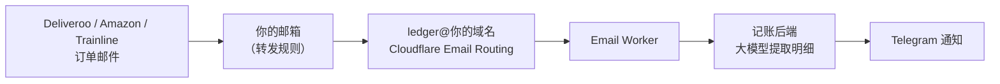

# 一角账本 · Ledger

[English](README.md) | **中文**

面向在英留学生的自托管记账本，以手机端为主。拍小票、转发订单邮件，或者给 Telegram 机器人发一句话，
即可自动识别、分类入账，并在英镑与人民币之间换算。可添加到手机主屏幕使用。

<p>
  
  
  
  
</p>

<sub>截图使用内置的演示数据（`DEMO_MODE=1`），所有记录均为虚构。</sub>

## 需要准备什么

只有密码是必需的。其余每一项开启一部分功能，不配置也不影响其他功能使用。

| 配置 | 是否必需 | 开启的功能 | 获取方式 |
|---|---|---|---|
| `ADMIN_TOKEN` | **必需** | 网站密码（同时是 Telegram 绑定口令） | 自行设定 |
| 智谱 API key（`VISION_API_KEY`） | 推荐 | 小票与截图识别、一句话记账、邮件账单、银行短信对账 | [open.bigmodel.cn](https://open.bigmodel.cn)；也可通过 `VISION_API_BASE_URL` 使用其他 OpenAI 兼容接口 |
| Telegram 机器人 token | 推荐 | 聊天记账、每日提醒、月度汇总、邮件入账通知 | @BotFather → `/newbot` |
| 托管在 Cloudflare 的域名 | 邮件账单需要 | 专用转发地址（如 `ledger@你的域名`，Email Routing + Worker），无需邮箱密码 | Cloudflare 免费套餐即可 |
| IMAP 邮箱 + 应用专用密码 | 可选 | Cloudflare 之外的另一种方式：轮询邮箱（如 Gmail）收取账单 | 邮箱服务商 |
| Google 服务账号 + 表格 | 可选 | 与室友共享的合租账本双向同步 | Google Cloud 控制台 |
| 服务器 | 部署需要 | 能运行 Docker 即可；自带脚本面向单节点 K3s | — |

汇率来自 frankfurter.dev，无需 key。

## 功能

- **四种录入方式**
  - 小票照片或截图：由视觉模型（智谱 GLM，OpenAI 兼容接口）识别商家、日期、总额、逐项明细和分类，确认后保存
  - 手动填写
  - Telegram 机器人：发送小票照片，或一句话，如 `12.5 coffee`、`Tesco 23.40`、`¥68 火锅`
  - 邮件账单：将 Deliveroo / Uber Eats / Just Eat / Amazon / Trainline 的账单邮件转发到专用地址，
    由大模型提取明细和订单号；同一订单的多封邮件只入账一次，营销邮件自动忽略
- **分类**：11 个主分类及子分类，明细可逐项单独归类（在 Tesco 买的洗发水计入购物而非买菜）
- **月度汇总**：英镑总额及人民币折算、日均、月底预估、与上月对比、分类占比、每日柱状图，可设月预算
- **汇率**：每日从 frankfurter.dev（欧洲央行）获取英镑兑人民币汇率，每笔按当日汇率锁定；
  人民币、欧元、美元小票自动折算为英镑
- **提醒**：当天未记账时 21:00（伦敦时间，可调）通过 Telegram 提醒；每月 1 日推送上月汇总
- **日程提醒**：跟 bot 说「提醒我明天吃饭的时候带小礼物」，它解析出时间、提前提醒；回「改到 18:00」可改时间，
  `/reminders` 查看，历史页日历上也能看到
- **对账**：粘贴银行短信或流水截图，逐条比对为「已记」「疑似」（`/ok` 确认）或「未记」（自动补录）
- **分账**：右滑与室友分账，可按商品标记「我的 / 公用 / 对方的」；左滑标记代付；按人汇总待收
- **合租账本**（可选）：与室友共享的 Google Sheet 双向同步，只推送账单中的公用部分
- **食材库存**：买菜明细中易腐食材按估计保质期进入库存，临期提醒，可选链接到菜谱站
- **合并去重**：按订单号、同日同额同商家、短信 ±3 天等规则，将邮件、截图、小票、短信合并为一笔
- **演示模式**：`DEMO_MODE=1` 时提供自动生成的演示数据，只读，不运行任何后台任务

## 本地试用

需要 Python 3.11+ 和 Node.js 20+。

```bash
# 后端（演示数据，无需任何 API key）
python3 -m venv .venv && .venv/bin/pip install -r backend/requirements.txt
cd backend && DEMO_MODE=1 ADMIN_TOKEN=guest ../.venv/bin/uvicorn app:app --port 8070

# 前端（另开一个终端）
cd frontend && npm install && DEMO_BACKEND_ORIGIN=http://127.0.0.1:8070 npm run dev
# 打开 http://localhost:3070/?demo=1
```

正式使用时去掉 `DEMO_MODE`，并把 `ADMIN_TOKEN` 设为你的密码。未配置 `VISION_API_KEY` 时只能手动记账；
未配置 `TELEGRAM_BOT_TOKEN` 时机器人和提醒不启动。全部配置项见 [`backend/config.py`](backend/config.py)。

## 目录结构

```
backend/    FastAPI + SQLite（data/ledger.db，小票原图在 data/receipts/）
  app.py         路由；除 /api/login、/api/health 外均需 Bearer ADMIN_TOKEN
  service.py     保存一笔（汇率换算）、Telegram 文案、月报
  vision.py      小票识别与一句话分类
  mail.py        邮件账单：MIME → 文本 → 大模型 → 入账（推送与 IMAP 两个入口）
  telegram.py    机器人长轮询
  scheduler.py   提醒调度（每分钟一次）
  pantry.py      食材库存同步与保质期估算
  sheets.py      Google Sheet 双向同步
  demo_seed.py   演示模式的数据
frontend/   Next.js 16（端口 3070，/api 反向代理到后端 8070）
deploy/     K3s 清单、Dockerfile、一键部署脚本、Cloudflare 邮件 Worker
```

## Telegram

<p>
  
  
</p>

发送小票照片，机器人会回复识别出的明细、中英文品名和人民币折算；也可以发一句话，如 `Pret coffee 3.45`、
`¥68 火锅`。每条回复都附有网页编辑链接，`/undo` 撤销上一笔。其他命令：`/today`、`/month`、`/fridge`、
`/used`、`/split`、`/help`。

1. 在 @BotFather 创建机器人，将 token 填入 `deploy/secret.yaml` 的 `TELEGRAM_BOT_TOKEN`
2. 部署后把网站密码作为消息发给机器人，即完成绑定
3. 提醒时间、测试消息、解除绑定均在设置页操作

<sub>聊天截图为示意：回复文字由机器人自身的代码根据示例数据生成。</sub>

## 邮件账单

外卖、网购、火车票本来就会发邮件账单，转发是最省事的记账方式：在 Outlook 或 Gmail 里设置一次转发规则，
此后每一封账单都会连同明细自动入账，并通过 Telegram 通知（见上方右图）。服务器不需要你的邮箱密码。



- 同一订单的多封邮件（下单确认、送达通知）按订单号合并，营销邮件自动忽略
- 只接受 `MAIL_ALLOWED_SENDERS`（逗号分隔，支持 `@域名`）中的发件人

**配置步骤（推送方式，推荐）**

1. Cloudflare → Email → Email Routing：为域名启用（MX 记录自动添加）
2. Workers & Pages：用 [`deploy/cloudflare-email-worker.js`](deploy/cloudflare-email-worker.js) 新建 Worker，
   添加变量 `LEDGER_URL`（网站地址）和 `LEDGER_SECRET`（与 `MAIL_INBOUND_SECRET` 相同）
3. Email Routing → 自定义地址，如 `ledger@`，动作选择「Send to a Worker」
4. 在 `deploy/local.env` 中填写 `MAIL_INBOUND_ADDRESS` 和 `MAIL_ALLOWED_SENDERS`
5. 在邮箱中添加规则，如「发件人包含 deliveroo → 转发到 ledger@你的域名」

**另一种方式（IMAP 轮询）**：支持应用专用密码的邮箱（如 Gmail）可配置 `MAIL_USER` / `MAIL_PASSWORD` /
`MAIL_FOLDER`，后端每 2 分钟拉取一次未读邮件。

## 部署（K3s）

```bash
cp deploy/local.env.example deploy/local.env           # 服务器、域名、发件人白名单
cp deploy/secret.example.yaml deploy/secret.yaml       # 密码与 API key
bash deploy/sync-and-deploy.sh
```

脚本会将源码同步到节点、在节点上构建镜像并导入 containerd，用 `local.env` 填充 `deploy/k8s.yaml`
中的占位符后执行 apply。secret 只在首次部署（或 `SEED_SECRET=1`）时写入。部署时会同时运行一个演示后端，
前端把 `guest` 身份的请求转发给它，访客可以浏览演示数据而看不到你的真实账目。

后端只能运行 **1 个副本**：Telegram 长轮询和提醒去重都在进程内完成。

## 许可证

[AGPL-3.0](LICENSE)
